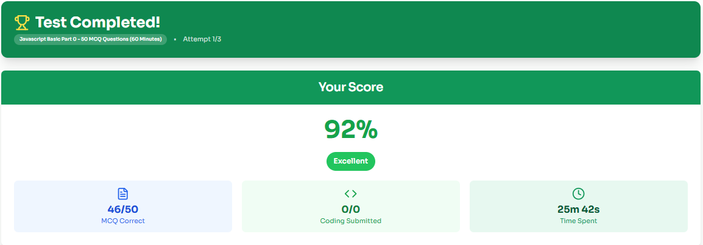
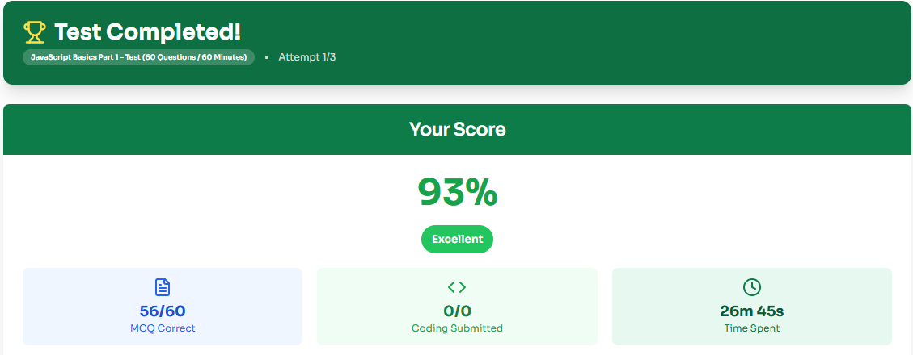
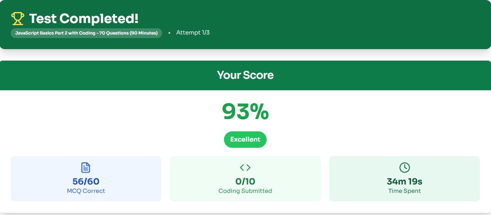

## Learning Progress

## The Testong Academy

Javascript Basic Part 0 - 50 MCQ Questions (60-minutes)
Status: Completed
Attempt: 1/3
MCQ Correct: 46/50
Score: 92%
Time Spent: 25m 42s
Date: 19 July 2026

See the screenshot below:

Javascript Basics Part 1 - Test (60 Questions / 60 Minutes)
Status: Completed
Attempt: 1/3
MCQ Correct: 56/60
Score: 93%
Time Spent: 26m 45s
Date: 26 July 2026

See the screenshot below:
 

Javascript Basic Part 2 with Coding - 70 Questions (90 Minutes)
Status: Completed
Attempt: 1/3
MCQ Correct: 56/60
Score: 93%
Time Spent: 34m 19s
Date: 26 July 2026

See the screenshot below:

